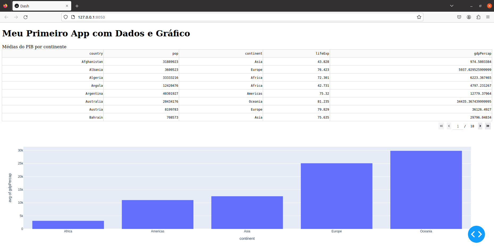

## 📝 Exercício da Aula 12 - Estatística

### Questão 01

Implementar em Python a visualização de dados calculando corretamente médias para os continentes com os dados utilizados em aula.

### Resultado - Layout do app

